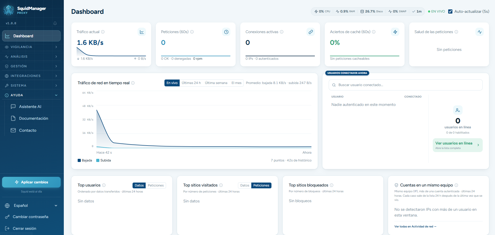

# Panel web — Secciones

<p align="center">
  <br>
  <sub>El Dashboard, la pantalla de inicio del panel.</sub>
</p>

El panel se organiza en tres grupos:

| Grupo | Sección | Función |
|-------|---------|---------|
| **Vigilancia** | Dashboard | Estado del proxy, tráfico en tiempo real, top usuarios y dominios |
| | Registros | Visor del access.log, con filtros y alertas de fuerza bruta |
| | Histórico | Meses ya cerrados, con resumen precalculado |
| | Auditoría | Log de todos los cambios realizados |
| **Políticas** | Usuarios | CRUD de usuarios del proxy |
| | Grupos | Agrupa usuarios y aplica políticas al grupo completo |
| | ACLs | CRUD de listas de control de acceso |
| | Categorías de dominios | ACLs de dominio con nombre reutilizable (ej: Redes sociales), para usar en reglas y delay pools |
| | Reglas de acceso | CRUD de reglas `http_access` con reordenamiento |
| | Ancho de banda | CRUD de delay pools (limitación de velocidad) |
| **Sistema** | LDAP | Configuración LDAP/Active Directory |
| | Kerberos | Autenticación Negotiate (SSO) contra Active Directory |
| | Certificado | Descarga CA + instaladores por sistema operativo |
| | Configuración | Parámetros generales de Squid |
| | Notificaciones | Avisos por email, Telegram y XMPP |
| | Syslog externo | Reenvío del access.log a un SIEM/ELK/Splunk |
| | Proxy padre | Salir a Internet por otro proxy (encadenado) |
| | Backup y migración | Exportar/restaurar configuración, importar squid.conf |
| | Actualizaciones | Ver y aprobar actualizaciones (instalación nativa) — ver [actualizaciones-automaticas.md](actualizaciones-automaticas.md) |
| | Administradores | Gestión de cuentas del panel (solo superadmin) |

Ver también [caracteristicas.md](caracteristicas.md) para el detalle de qué
hace cada función, y [api-reference.md](api-reference.md) para los endpoints
que usa cada sección.

---

## Módulos, Contacto y Syslog (cierre del plan de mejora)

### Módulos (Sistema → Módulos)

Enciende o apaga las partes opcionales del panel. Todos vienen activos salvo
**Panel central** y **Portal de autoservicio de usuarios** (ver
[docs/authentication.md](authentication.md#portal-de-autoservicio-de-los-usuarios-locales)),
que se habilitan a mano. Apagar un módulo no borra sus datos.

```bash
# Consultar el estado desde la API (sesión de administrador)
curl -b cookies.txt https://panel:3000/api/modules
```

### Contacto

Formulario de reporte/sugerencia, datos de la instalación (versión, modo de
despliegue, Squid, sistema) con botón **Copiar** y casilla para adjuntarlos al
mensaje, y el bloque de copyright/licencia/terceros. `GET /api/contact/info`
devuelve esos datos.

### Syslog: facility

Usa `local0`–`local7` para tus propios servicios; se recomienda `local0`. Un
valor fuera de la lista se rechaza con HTTP 400.

Ejemplo de configuración: host `172.31.27.50`, puerto `514`, protocolo `udp`,
formato `rfc3164`, facility `local0`.

---

## Notificaciones, reporte diario y zona horaria (1.0)

- **Avisos por correo con formato** (HTML + texto plano) para todos los eventos; dos nuevos:
  *cuota agotada* e *intentos de entrar a sitios bloqueados* (umbral configurable).
- **Reporte diario** por correo: requiere SMTP y un administrador con correo; hora configurable
  (por defecto 23:55). `POST /api/notifications/daily-report/send-now` envía uno de prueba.
- **Zona horaria** (Sistema → Configuración, `GET/PUT /api/system/timezone`): define la medianoche
  de las cuotas, el corte de los gráficos por día y la hora del reporte.
- **ACLs**: `GET /api/acls/usage` alimenta la columna «Uso».
- **Actividad de red**: `GET /api/panel/actividad-serie?tipo=...` (gráfica por pestaña) y
  `GET /api/panel/rendimiento-serie` (Latencia y errores). El PDF recoge todas las pestañas.

## Requisitos de sistema añadidos

`libarchive-tools` (comando `bsdtar`) para importar `.rar` / `.7z`; ya lo instalan `install-nativo.sh`
y el Dockerfile del backend.

Al cambiar `cache_dir`, «Aplicar cambios» **reinicia** Squid en vez de recargarlo (Squid no puede
crear el almacenamiento en disco con `-k reconfigure`).
